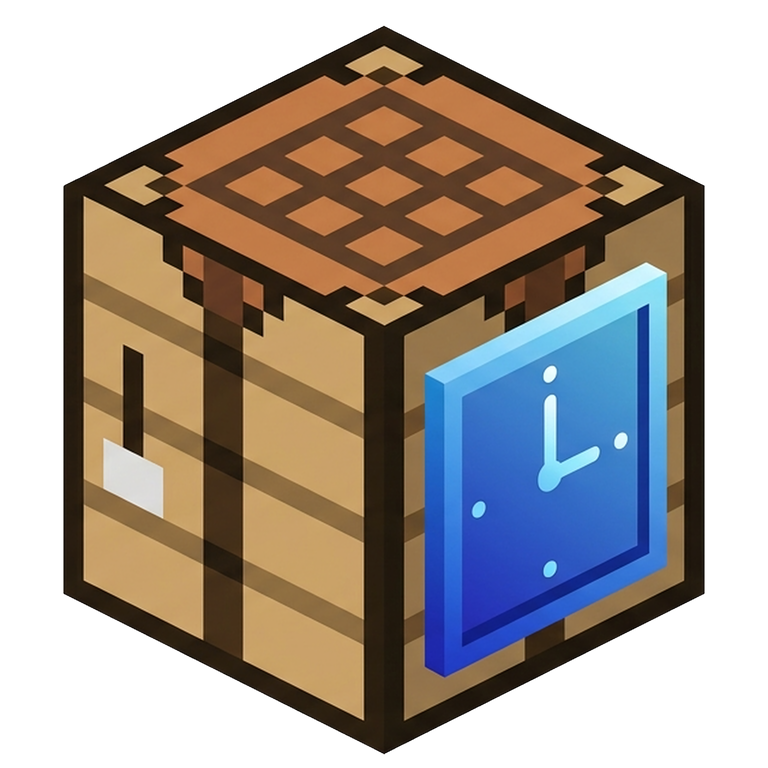

#  CianovaLauncher v3.0
### 🚀 Edición definitiva migrada a Qt6 (PySide6)

[](https://www.python.org/)
[](https://www.qt.io/qt-for-python)
[](https://flatpak.org/)
[](https://www.kernel.org/)
[](Docs/LICENCE%20&%20TERMINOS%20y%20CONDICIONES.md)

**CianovaLauncher** es una interfaz gráfica moderna diseñada para facilitar la gestión, instalación y personalización de **Minecraft: Bedrock Edition** en Linux. Esta herramienta trabaja en conjunto con la base del proyecto **MCPELauncher-manifest**, proporcionando una experiencia de usuario amigable y potente.

🌐 Visita nuestra página web del proyecto con toda la info organizada, detalles y métodos de descarga: 

### [plagaplusdev.github.io/CianovaLauncher-mcpelauncher](https://plagaplusdev.github.io/CianovaLauncher-mcpelauncher/)

---

## ✨ Características de la v3.0
- **Migración a Qt6:** Interfaz rediseñada desde cero con PySide6 para mayor fluidez, estabilidad y soporte HiDPI.
- **Asistente de Configuración:** Guía paso a paso para nuevos usuarios (idioma, temas, términos legales).
- **Google Play Integration:** Descarga versiones oficiales directamente (requiere cuenta con el juego comprado).
- **Gestión Avanzada:** Perfiles independientes con Symlinks, iconos personalizados por versión y accesos directos al escritorio.
- **Optimización Nvidia:** Soporte para Nvidia Prime y Modo Zink (OpenGL sobre Vulkan) para corregir errores gráficos.
- **Sistema de Logs:** Registro detallado de hardware y ejecución para facilitar el soporte técnico.

---

## 1. Ejecución

### Requisitos Previos

**NOTA:** Antes de cualquier instalación por **Flatpak** recuerda instalarlo en el caso de que no lo tengas.
Link para configurar Flatpak la primera vez según tu distro: [FLATPAK SETUP](https://flathub.org/en/setup)
**NOTA 2:** Tu PC debe soportar instrucciones x86_64 y tener **OpenGLES 3.0** para las versiones modernas de Minecraft Bedrock.
**NOTA 3:** Si tu distro es muy estricto con permisos y no tiene `flatpak-spawn` va a hacer un subproceso local o reemplazar el proceso del launcher (Solo usara los binarios disponibles en el Flatpak. Si no es muy estricto tipo Ubuntu, Mint, Debian, Arch, ZorinOS funcionara completamente.)

### Instalación para Flatpak

#### Método Express (Un solo comando)
 
Si ya tienes Flatpak instalado, este script lo hace todo por ti: añade el repositorio, instala los runtimes de Qt6 y deja el launcher listo para arrancar.
 
```bash
curl -fsSL https://raw.githubusercontent.com/PlaGaPlusDev/CianovaLauncher-mcpelauncher/gh-pages/install.sh | bash
```
 
> Puedes [revisar el script en GitHub](https://github.com/PlaGaPlusDev/CianovaLauncher-mcpelauncher/blob/gh-pages/install.sh) antes de ejecutarlo si quieres ver qué hace paso a paso. Si Flatpak no está instalado, el script te indica cómo hacerlo según tu distro.


#### Metodo 1 (Recomendado) - Actualizaciones

Descarga el archivo `CianovaLauncher.flatpakrepo` en **RELEASES** o **EXTRA** para instalar y recibir actualizaciones desde tu gestor de software. (Esto descarga automáticamente las ultimas actualizaciones y runtimes necesarios).

O añade manualmente con:
- Añade el repositorio
```bash
flatpak remote-add --user --if-not-exists CianovaLauncher https://plagaplusdev.github.io/CianovaLauncher-mcpelauncher/CianovaLauncher.flatpakrepo
```

- Asegurate de instalar los runtimes necesarios que puedes instalarlos manualmente con:

```bash
flatpak install org.kde.Platform//6.10 io.qt.qtwebengine.BaseApp//6.10
```

- Ahora instala el Launcher :
```bash
flatpak install --user CianovaLauncher org.cianova.Launcher
```


#### Metodo 2 - Bundle

Descarga e instala `CianovaLauncher.flatpak` en **RELEASE** publicado en el GitHub oficial del launcher y ábrelo con algún **gestor de software** que tengas o usando el comando:

```bash
flatpak install --user CianovaLauncher.flatpak
```
*(NOTA: El nombre del archivo también puede incluir el numero de la versión).*

Eh instala los runtimes necesarios con:
```bash
flatpak install org.kde.Platform//6.10 io.qt.qtwebengine.BaseApp//6.10
```

### Instalación no-Flatpak:

Descarga de la última **RELEASE** el archivo `CianovaLauncher-v3.0.tar.gz` y lo extraes en la carpeta que desees. También compila o descarga los binarios del **MCPELAUNCHER-MANIFEST**; se recomienda usar un pack de confianza y colocar la carpeta `bin` dentro de la raíz del launcher.

**NOTA:** En el paquete portable ya se incluyen binarios pre-compilados y sus librerías necesarias de forma local.

Para iniciar el launcher, simplemente haz doble clic en el script `CianovaLauncher.sh` o ejecútalo desde la terminal:

```bash
./CianovaLauncher.sh
```

---
Luego ve a Ajustes y completa la configuración de binarios, requisitos y guarda la config.

**NOTA 2:** Dependiendo de tu distribución y *PKG MANAGER* algunos nombres de paquetes pueden variar. Usa la lista de dependencias como referencia.

**Para saber más consulta el [MANUAL DE USO](Docs/MANUAL%20DE%20USO.md).**

---
## ⚖️ Términos y Condiciones (Resumen)

El uso de esta herramienta implica la aceptación de los siguientes puntos:
1. **Independencia:** Este launcher es una interfaz visual independiente y NO incluye el juego ni las APKs necesarias de forma ilícita.
2. **Atribución:** Se reconoce el trabajo del proyecto **MCPELauncher** (ChristopherHX, MCMrARM y equipo) como la base técnica esencial, así como el uso de las APIs de Google Play.
3. **No Lucrativo:** Esta herramienta es gratuita y de código abierto (GPL v3). Mantengamos el espíritu colaborativo.
4. **Responsabilidad:** Los desarrolladores no se hacen responsables por pérdida de datos, problemas de cuenta o fallos derivados del uso indebido.

> 📄 Consulta el documento completo en: [LICENCIA & TÉRMINOS Y CONDICIONES](Docs/LICENCE%20&%20TERMINOS%20y%20CONDICIONES.md)

---
<p align="center">
  <b>Hecho con ❤️ y 🤖 para la comunidad Linux.</b>
</p>
